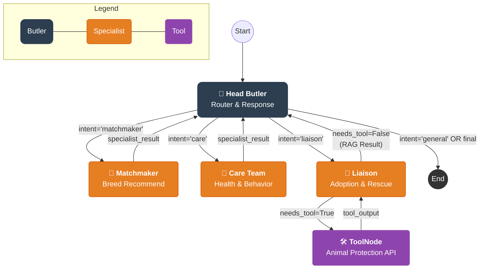

# 🏗️ System Architecture (LangGraph)

ZIPSA 서비스는 **4-Node Agent System**으로 설계되었습니다.
사용자의 요청은 **Head Butler**를 통해 분류되며, 전문가 노드에서 처리 후 반드시 Head Butler를 거쳐 종료됩니다.

---

## 📊 Graph Visualization (Live Structure)

아래 다이어그램은 실제 소스 코드(`src/agents/graph.py`)에서 생성된 LangGraph 구조입니다.

---

## 🔄 Workflow Logic

### 1. Head Butler (Router & 유일한 Exit Point)
- **Start Node**: `head_butler`
- **Logic**: 사용자의 입력(Message)을 LLM Structured Output으로 분석하여 라우팅(`matchmaker`, `liaison`, `care`, `general`) 결정.
- **Conditional Edge**:
    - `router_decision == "matchmaker"` → **Matchmaker** 노드로 이동.
    - `router_decision == "liaison"` → **Liaison** 노드로 이동.
    - `router_decision == "care"` → **Care Team** 노드로 이동.
    - `router_decision == "general"` → 직접 응답 후 종료(`__end__`).
- **Return Visit**: 전문가 노드에서 `specialist_result`(구조화 JSON)와 함께 복귀 시 → 후처리(페르소나 반영 + 마무리 멘트) 후 `__end__`.
- **유일한 END 접근**: 그래프에서 `__end__`로 갈 수 있는 노드는 `head_butler`뿐입니다.

### 2. Specialist Nodes
전문가 노드는 `AIMessage`가 아닌 **구조화된 JSON**(`specialist_result`)을 반환하며, 항상 `head_butler`로 복귀합니다.

#### Matchmaker
- **Node**: `matchmaker_node` (`src/agents/matchmaker.py`)
- **기능**: 품종 추천 (RAG: `specialist="Matchmaker"`, `categories="Breeds"` 필터)
- **완료 후**: `specialist_result` → `head_butler`로 복귀

#### Liaison
- **Node**: `liaison_node` (`src/agents/liaison.py`)
- **기능**: 입양/구조 정보 안내 (RAG: `specialist="Liaison"`, 222건), 구조동물 조회(Tool)
- **Tool Call**: `search_abandoned_animals` 도구 호출 시 → `tools` 노드로 이동 → 결과와 함께 `liaison`으로 복귀
- **완료 후**: `specialist_result` → `head_butler`로 복귀

#### Care Team
- **Node**: `care_team_node` (`src/agents/care_team.py`)
- **기능**: LLM Structured Output으로 `Physician`(의료) / `Peacekeeper`(행동) 내부 분류 후 해당 specialist 태그로 RAG 검색.
- **완료 후**: `specialist_result` → `head_butler`로 복귀

### 3. Tools Node
- **Node**: `ToolNode` (`src/agents/tools/animal_protection.py`)
- **기능**: 국가동물보호정보시스템 유기동물 조회 API
- **위치**: Liaison ↔ Tools 순환 엣지로 연결

### 4. Inter-Agent Communication
- **전문가 → Head Butler**: `specialist_result` (구조화 JSON) — 페르소나, RAG 문서, 분류 결과 포함
- **Head Butler → 사용자**: `AIMessage` — specialist_result를 후처리하여 최종 응답 생성
- **일반 질문**: Head Butler가 직접 `AIMessage`로 응답

### 5. State Management
- **Persistence**: `MemorySaver`를 사용하여 대화 맥락(Context)을 유지합니다.
- **Shared State**: `AgentState` 객체를 통해 `messages`, `user_profile`, `router_decision`, `specialist_result`, `recommendations`를 공유합니다.

---

## 🎭 Prompt Management System
ZIPSA는 하드코딩된 프롬프트 대신, 유연한 관리를 위해 **Prompt Manager**를 도입했습니다.
- **Config-driven**: 모든 페르소나와 지침은 `src/core/prompts/prompts.yaml`에 관리됩니다.
- **Dynamic Loading**: `src/core/prompts/prompt_manager.py` (Singleton)가 프롬프트를 메모리에 로드하며, 실시간 업데이트를 지원합니다.
