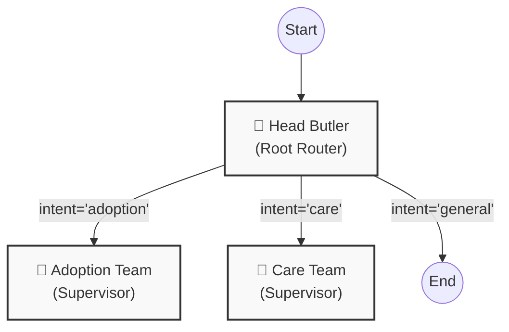
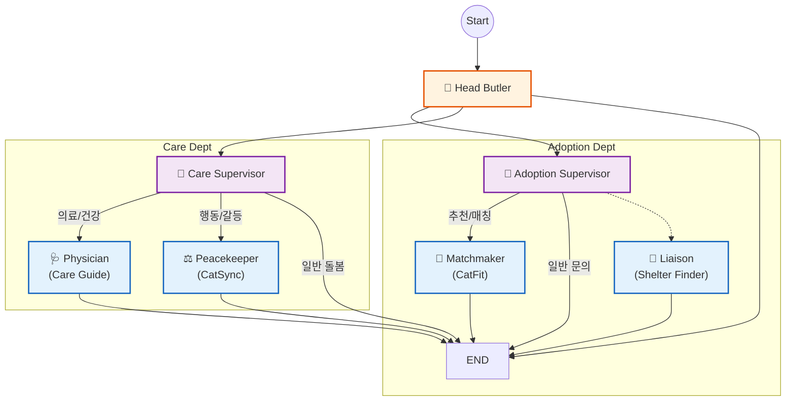

# 🏗️ Zipsa Agent Architecture (v2.2)

이 문서는 LangGraph로 구현된 Zipsa 에이전트의 **계층형 라우팅 구조(Hierarchical Routing)**를 시각화합니다.

## 1. High-Level Flow (Team Routing)
최상위 **Head Butler**는 사용자의 의도를 분석하여 적절한 **전문가 팀(Supervisor)**으로 이관합니다.

---

## 2. Detailed Graph (Expert Nodes)
각 팀(Team) 내부에서 **세부 전문가(Specialist)** 노드로 최종 라우팅이 일어나는 전체 구조입니다.

## 3. Node Descriptions
| Node | Type | Description |
|---|---|---|
| **Head Butler** | Root Router | 사용자의 최상위 의도를 분류 (Adoption / Care / General). 직접 답변하지 않음. |
| **Adoption Team** | Supervisor | 입양 관련 요청을 세분화하여 Matchmaker(추천) 여부를 결정. |
| **Care Team** | Supervisor | 케어 관련 요청을 의료(Physician) 또는 행동(Peacekeeper)으로 분류. |
| **Matchmaker** | Expert | RAG를 사용하여 사용자의 환경에 맞는 품종 추천 및 설명. |
| **Physician** | Expert | RAG를 사용하여 건강/질병 관련 가이드 제공. |
| **Peacekeeper** | Expert | RAG를 사용하여 이상 행동 및 합사 문제 해결책 제시. |
