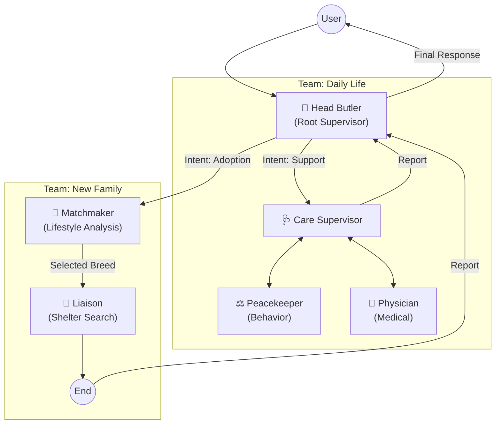

# ⚙️ 시스템 아키텍처 및 워크플로우 (Technical Architecture)

집사Helper는 **Hierarchical LangGraph (Multi-Agent Teams)** 구조를 채택하여 복잡한 사용자 의도를 세분화하여 처리합니다.

---

## 🏛️ Architecture Diagram



---

## ⚙️ Workflows (Complex Patterns)

### 1. Sequential Workflow (Team: New Family)
- **Scenario:** 입양 상담
- **Flow:** `Matchmaker`가 최적의 품종을 도출하면, 해당 정보를 `Liaison`에게 전달(State Passing)하여 즉시 보호소 매칭을 수행합니다. 사용자가 따로 두 번 물어볼 필요가 없습니다.

### 2. Collaborative Workflow (Team: Daily Life)
- **Scenario:** 이상 행동 상담 (예: "고양이가 갑자기 소변 테러를 해요")
- **Flow:** `Care Supervisor`가 이를 분석합니다.
  1. 먼저 `Physician`에게 의료적 원인(방광염 등) 확인 요청.
  2. 의료적 문제가 없다면 `Peacekeeper`에게 행동학적 원인 분석 요청.
  3. 두 소견을 종합하여 최종 답변 생성.

---

## 💻 Logic Flow (Hierarchical Implementation)

```python
# 1. Define Sub-Graph: Adoption (Sequential)
adoption_builder = StateGraph(AdoptionState)
adoption_builder.add_node("matchmaker", matchmaker_node)
adoption_builder.add_node("liaison", liaison_node)
adoption_builder.add_edge("matchmaker", "liaison") # Direct dependency
adoption_graph = adoption_builder.compile()

# 2. Define Sub-Graph: Care (Hierarchical/Collaborative)
care_builder = StateGraph(CareState)
care_builder.add_node("supervisor", create_supervisor(["physician", "peacekeeper"]))
care_builder.add_node("physician", physician_node)
care_builder.add_node("peacekeeper", peacekeeper_node)
# ... edges back to supervisor ...
care_graph = care_builder.compile()

# 3. Root Level Graph
root_builder = StateGraph(RootState)
root_builder.add_node("head_butler", head_butler_node)
root_builder.add_node("adoption_team", adoption_graph)
root_builder.add_node("care_team", care_graph)

root_builder.add_conditional_edges("head_butler", route_to_team)
app = root_builder.compile()
```
