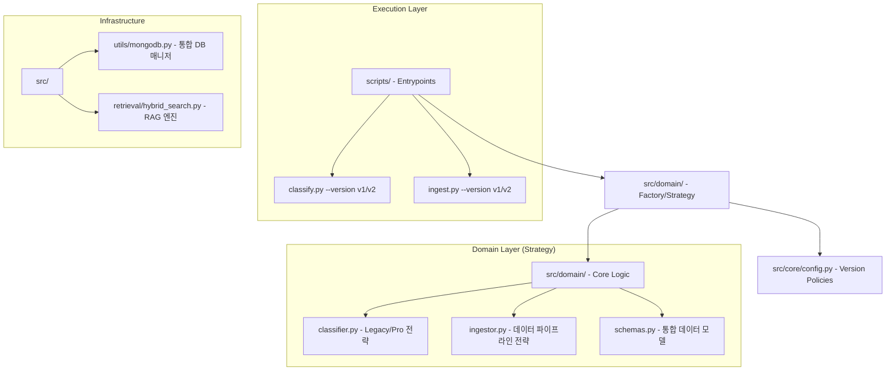

# 🏗️ 리팩토링된 프로젝트 구조 (Policy-Based Architecture)

집사Helper (Zipsa Helper) 프로젝트는 **Strategy 및 Factory 패턴**을 도입하여, V1/V2를 물리적 폴더가 아닌 **정책(Policy)**으로 관리하도록 리팩토링되었습니다.

---

## 🗺️ High-Level Map (Policy Flow)



---

## 📂 리팩토링된 디렉터리 트리 (Unified & Flat)

```text
집사Helper (Zipsa Helper) 🐾
├── scripts/                     # 📂 통합 실행부 (Entrypoints)
│   ├── classify.py              # 전처리 및 분류 통합 실행기 (--version v1|v2)
│   ├── ingest.py                # MongoDB 데이터 적재 통합 실행기 (--version v1|v2)
│   ├── crawl/                   # 데이터 수집용 크롤러
│   ├── process/                 # 원본 데이터 전처리용 유틸
│   └── validate/                # 데이터 정합성 검증
├── src/                         # 📂 핵심 라이브러리 (Core Library)
│   ├── core/                    # └─ 핵심 설정 및 정의
│   │   └── config.py            # [중요] V1/V2 정책(Policy) 및 설정 중앙 관리
│   ├── domain/                  # └─ 비즈니스 로직 및 정책 구현 (Strategy)
│   │   ├── classifier.py        # 클래시파이어 전략 및 팩토리
│   │   ├── ingestor.py          # 인제스터 전략 및 래퍼
│   │   └── schemas.py           # Pydantic 데이터 모델 통합
│   ├── agents/                  # └─ LangGraph 에이전트 워크플로우
│   ├── retrieval/               # └─ 하이브리드 RAG 검색 엔진
│   ├── utils/                   # └─ 공용 유틸리티
│   │   └── mongodb.py           # V1/V2 멀티 클러스터 연결 관리
│   └── ui/                      # └─ Streamlit 프론트엔드
├── data/                        # 📂 지식 기반 데이터 저장소
│   ├── v1/                      # v1 정책 적용 결과물
│   └── v2/                      # v2 정책 적용 결과물
├── docs/                        # 📂 프로젝트 문서 및 가이드 (Categorized)
│   ├── 01_concept/              # └─ 프로젝트 기획 및 철학
│   ├── 02_design/               # └─ 시스템 및 아키텍처 디자인
│   ├── 03_data/                 # └─ 데이터 파이프라인 및 분석 리포트
│   ├── 04_api/                  # └─ API 명세 및 외부 연동 규격
│   ├── 05_guides/               # └─ 개발 환경 및 운영 가이드
│   └── dev_logs/                # └─ 개발 히스토리 로그
└── .env                         # 환경 변수 설정
```

---

## 🏛️ 주요 리팩토링 포인트 (Refactoring Highlights)

1.  **폴더 기반 삭제 (Anti-Folder Versioning)**: `src/preprocessing/v1`, `v2` 등의 폴더를 제거하고 `src/domain` 내에서 전략 클래스로 관리합니다. 새로운 버전(V3)이 추가되어도 폴더 구조 변경 없이 `config.py` 정책 추가로 대응 가능합니다.
2.  **클린 코드 및 SRP 준수**:
    - **`scripts/`**: 사용자의 명령을 받아 도메인 로직으로 전달하는 얇은(Thin) 레이어로 개선되었습니다.
    - **`src/domain/`**: 판단과 변환 로직만 담당하며, 인프라(DB)와 분리되었습니다.
3.  **깊이 최적화 (Max Depth 3)**: 대부분의 핵심 파일이 `src/[domain]/[file].py` 구조로 배치되어 인지 부하를 최소화했습니다.
4.  **통합 엔트리포인트**: 여러 개로 흩어져 있던 `classify_v1.py`, `ingest_v2.py` 등을 `classify.py`, `ingest.py`로 통합하여 실행 흐름을 일원화했습니다.

---
이제 집사Helper는 기계뿐만 아니라 사람도 읽기 쉬운 **'평평하고 의미 있는'** 구조를 가지게 되었습니다! 🐾✨
