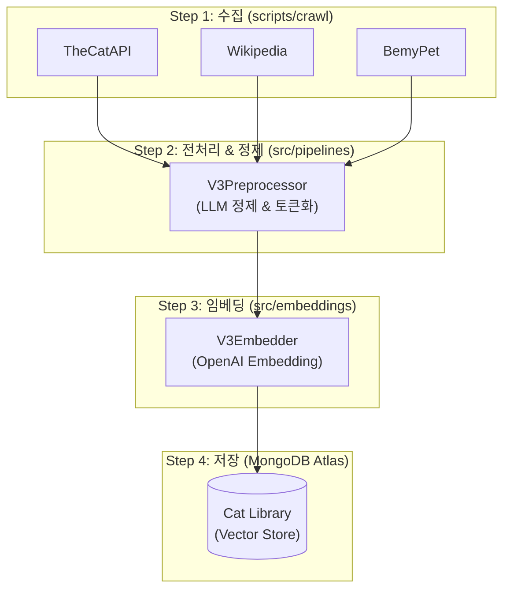

# 01. Project Structure

이 프로젝트의 디렉토리 구조와 각 모듈의 역할을 설명합니다.

```
SKN22-3rd-3Team/
├── .github/                # GitHub 관련 설정 (PR Template 등)
├── data/                   # 데이터 파일 (품종 데이터, 임베딩 등)
├── docs/                   # 프로젝트 문서
│   ├── 01_project/               # 기획 및 개요
│   ├── 02_system_architecture/   # 시스템 아키텍처
│   ├── 03_convention_and_guides/ # 협업 가이드
│   ├── 04_api/                   # API 명세 및 가이드
│   ├── 05_data/                  # 데이터 명세
│   ├── 06_feature/               # 기능 명세
│   └── 07_report/                # 프로젝트 리포트 (체크리스트, 로드맵)
├── scripts/                # 유틸리티 스크립트 (크롤링, 전처리 등)
├── src/                    # 메인 소스 코드
│   ├── agents/             # LangGraph 에이전트 및 그래프 정의
│   │   ├── graph.py        # 그래프 진입점
│   │   ├── state.py        # 상태 관리 (AgentState)
│   │   └── tools/          # 커스텀 도구 (Tools)
│   ├── core/               # 핵심 설정 및 공통 모듈
│   │   ├── config.py       # 환경 변수 및 설정
│   │   └── prompts/        # 프롬프트 관리
│   ├── embeddings/         # 임베딩 모델 관련 로직
│   ├── pipelines/          # 데이터 파이프라인 (ETL)
│   ├── ui/                 # Streamlit UI 코드
│   └── utils/              # 헬퍼 함수
├── .env.example            # 환경 변수 예시
├── requirements.txt        # 의존성 패키지 목록
├── README.md               # 프로젝트 메인 설명
└── CLAUDE.md              # AI Assistant 가이드
```

## 주요 디렉토리 설명

### `src/agents`
LangGraph 기반의 Multi-Agent 시스템이 구현된 핵심 디렉토리입니다.
- **graph.py**: `StateGraph`를 정의하고 실행 가능한 `app` 객체를 생성합니다.
- **state.py**: 에이전트 간 공유되는 상태(`AgentState`)를 정의합니다.

### `src/pipelines`
데이터 수집, 전처리, 임베딩 적재를 담당하는 파이프라인 코드입니다.
- **v1/v2/v3**: 버전별 파이프라인이 분리되어 유지보수성을 높입니다.

### `src/ui`
Streamlit을 이용한 사용자 인터페이스 코드입니다.
- **app.py**: UI 진입점입니다.

### `scripts`
실행 가능한 Python 스크립트 모음입니다.
- **crawl/**: 데이터 크롤러
- **process/**: 데이터 전처리 스크립트

---

## 데이터 파이프라인 (V3 Pipeline Flow)
ZIPSA의 데이터가 어떻게 수집되고 처리되는지 보여주는 흐름도입니다.



### 흐름 설명
1. **수집 (Crawl)**: `scripts/crawl/`의 스크립트들이 외부 사이트에서 원본 데이터를 수집하여 `data/raw/`에 JSON으로 저장합니다.
2. **전처리 (Process)**: `src/pipelines/v3/preprocessor.py`가 노이즈를 제거하고, LLM을 사용해 검색에 최적화된 제목과 요약을 생성합니다.
3. **임베딩 (Embed)**: `src/pipelines/embeddings/` 모듈이 정제된 텍스트를 벡터(숫자) 형태로 변환합니다.
4. **저장 (Load)**: 최종 데이터는 MongoDB Atlas에 저장되어, 검색 엔진(RAG)이 사용할 준비를 마칩니다.

