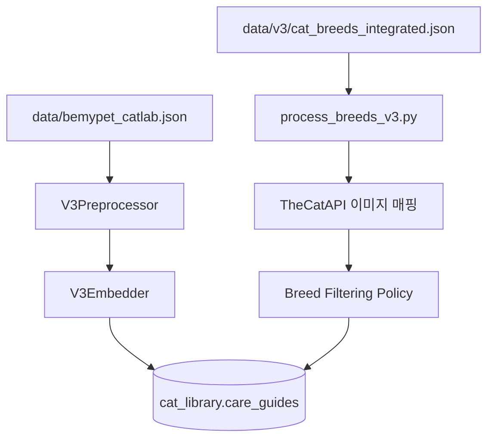

# V3 파이프라인 전략 및 RAG 최적화 보고서

> `v3_pipeline_flow.md`와 `v3_pipeline_strategy_report.md`를 병합한 통합 문서입니다.

---

## 1. 개요

V3 파이프라인은 V2의 점진적 개선 방식에서 벗어나, **고정밀 프로덕션급 데이터 아키텍처**로 전면 재설계되었습니다.
핵심 목표는 의미적 노이즈를 제거하고 메타데이터를 표준화하여 RAG 검색 정밀도를 극대화하는 것입니다.

### 핵심 원칙
- **완전 독립**: V2 중간 산출물 의존성 제거. 원본 데이터(`data/bemypet_catlab.json`)부터 처음부터 처리
- **LLM 기반 정제**: `gpt-4o-mini`를 사용해 검색 최적화 제목 재작성 및 구조화 요약 생성
- **노이즈 감소**: 원본 본문(text)을 벡터 임베딩에서 제외하여 의미적 드리프트 방지

---

## 2. 파이프라인 흐름

### Stage 1: 전처리 (`preprocessor.py`)
- 원본 텍스트 정제, UID 생성, Kiwi 도메인 사전 토큰화
- LLM 배치 분류: `title_refined`, `intent_tags`, `summary`, `keywords` 추출
- 출력: `data/v3/processed.json`

### Stage 2: 임베딩 (`embedder.py`)
- 임베딩 입력 구성: `[Categories][Specialists] Title | Keywords | Summary`
- 배치 크기 100건, 동시성 5배치
- OpenAI `text-embedding-3-small` (1536차원)
- 출력: `data/v3/embedded.pkl`

### Stage 3: 적재 (`loader.py`)
- MongoDB `cat_library.care_guides`로 비동기 일괄 upsert
- 기사 + 품종 데이터를 단일 컬렉션에 통합 저장 (`categories`, `specialists` 필드로 구분)

---

## 3. RAG 최적화 설계

### A. 의미 정밀도 (벡터 검색)
- **전략**: `Title | Summary | Keywords`만 임베딩 (본문 text 제외)
- **이유**: 원본 본문에는 "안녕하세요", "광고 문의" 등 비관련 텍스트가 포함되어 오탐(False Positive) 유발. 핵심만 임베딩하여 벡터 공간의 구분력 극대화
- **결과**: V2 대비 Top-K 정밀도 대폭 향상

### B. 고재현율 매칭 (키워드 검색)
- **전략**: 전체 `text`를 보존하고, 커스텀 도메인 사전으로 `tokenized_text` 생성
- **이유**: "췌장염 예방 전용 보조제 이름" 같은 세부 용어는 요약에 없을 수 있음. BM25 전문 검색으로 보완
- **매핑**: Atlas Search `keyword_index` (BM25)

### C. 분류 기반 필터링
- **전략**: `categories`와 `specialists`를 영문 키로 표준화
- **이유**: 한국어 동의어 문제 방지 (예: "내과" vs "의료")
- **매핑**: `HybridRetriever`의 `filter` 절에서 직접 매칭

---

## 4. 품종 필터링 정책

`src/agents/filters/breed_criteria.py`에서 구현된 수치형 매핑 정책:
- **쿼리 우선**: 사용자 프로필보다 명시적 질문에서 필터 조건을 우선 추출 (논리 충돌 방지)
- **범위 확장**: "털 안 빠지는"(Level 1) 요청 시 Level 2(적음)까지 포함하여 매칭률 향상

---

## 5. 데이터 스키마

| 구분 | 필드 | 용도 |
| :--- | :--- | :--- |
| **식별** | `uid` | 표준화 ID (`v3_XXXXX` / `breed_XXX`) |
| **표시** | `title_refined` | LLM 생성 검색 최적화 제목 |
| **RAG 컨텍스트** | `text` | 정제된 전문 (LLM 응답 생성용) |
| **의미 검색** | `summary` | 전문 1문장 요약 |
| **키워드 검색** | `keywords` | 고신호 도메인 키워드 3~5개 |
| **의도** | `intent_tags` | 감정/기능 태그 (예: `Emergency`) |
| **주제 필터** | `categories` | 영문 표준 카테고리 |
| **전문가 필터** | `specialists` | 페르소나 기반 분류 (예: `Physician`) |

---

## 6. 검증 상태
- **스키마 검증**: Pydantic 모델 통과
- **파이프라인 테스트**: 3건 배치 처리 검증 완료
- **검색 준비**: `vector_index` 및 `keyword_index` (BM25) Atlas Search 인덱스 정의 완료
- **노트북 동기화**: V3 구조에 맞게 리팩토링 및 실행 검증 완료
